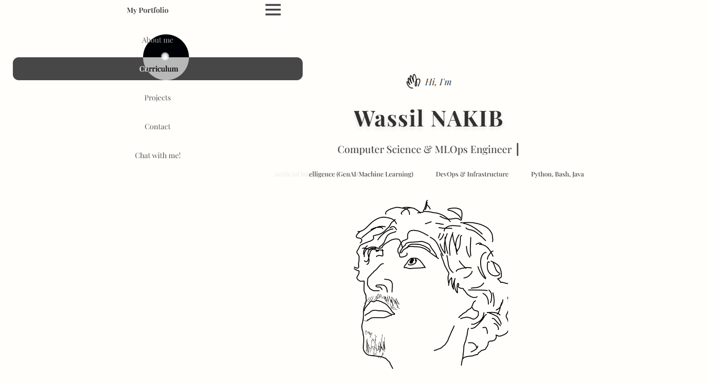

Mon portfolio --> [Clickez ici](https://sillovv.github.io)



## Assets

Les images sont servies en WebP via `<picture>`, les fichiers PNG/JPG d'origine
restant en fallback. Après avoir ajouté ou remplacé une image, régénérer les
dérivés :

```bash
pip install pillow
python tools/optimize_images.py
```

Le script redimensionne chaque image à la taille réellement affichée par le CSS
puis écrit un `.webp` à côté du fichier source.
